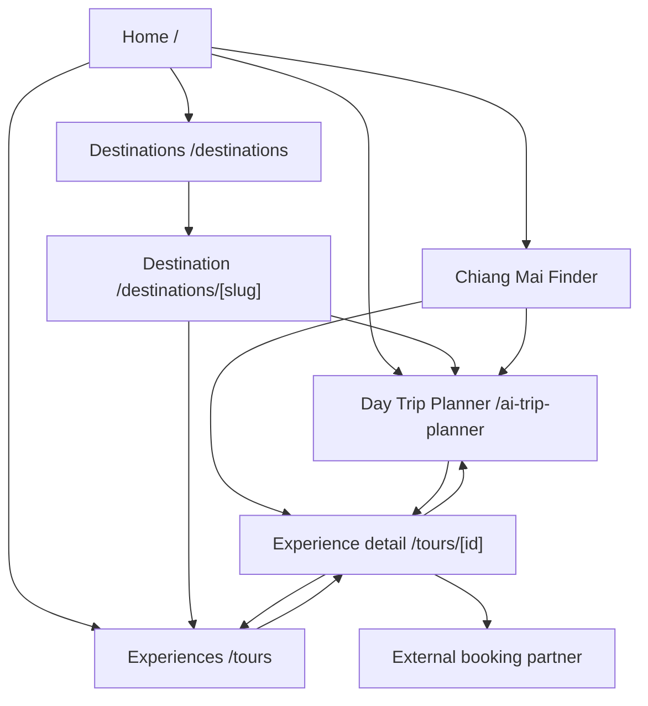

# RadarScout Public Site Map

Status: proposed information architecture for review. This document does not change routes, robots, sitemap output, or index policy.

## Product boundary

RadarScout is a Thailand-wide day-trip discovery and planning product. Coverage expands city by city. It helps a traveler express intent, compare reviewed experiences, inspect a structured day, and continue to an external booking partner. It does not provide its own checkout, payment, inventory, availability confirmation, or booking confirmation.

## Route structure

| Route | Page | Status | Primary purpose | Primary CTA |
| --- | --- | --- | --- | --- |
| `/` | Home | Existing, restructure later | Explain the product and start with a trip idea | `Plan my day` |
| `/ai-trip-planner` | Thailand Day Trip Planner | Existing | Convert a prompt into a structured TripSpec and reviewed matches | `See matching day trips` |
| `/tours` | Experiences listing | Existing | Browse and filter reviewed Thailand day trips | `View experience` |
| `/tours/[id]` | Experience detail | Existing | Review one experience and continue safely | `Check availability` |
| `/destinations` | Destinations index | Existing | Show cities with reviewed coverage | `Explore [city]` |
| `/destinations/[slug]` | Destination landing | Existing | Introduce a city and its reviewed day trips | `Plan a day in [city]` |
| `/chiang-mai/elephant-camp-finder` | Chiang Mai intent landing | Existing, preserve | High-intent guided entry for the current validated city/category | `Plan with RadarScout` |
| `/about-us` | About | Existing | Explain editorial review, scope, and handoff boundaries | `Explore day trips` |
| `/contact` | Contact | Existing | Provide support and partner contact paths | `Contact RadarScout` |
| `/privacy-policy` | Privacy | Existing | Legal and privacy disclosure | None |
| `/terms-of-service` | Terms | Existing | Terms and product boundaries | None |

## Navigation model

### Primary navigation

1. Plan a day -> `/ai-trip-planner`
2. Browse experiences -> `/tours`
3. Destinations -> `/destinations`
4. How it works -> `/#how-it-works`
5. About -> `/about-us`

Primary nav CTA: `Plan a day`.

### Footer navigation

- Discover: Planner, Experiences, Destinations
- Company: About, Contact
- Legal: Privacy, Terms
- Coverage: only cities with reviewed public content; do not publish empty destination links as if they have inventory.

## Page relationships

## Primary user journeys

### Prompt-first journey

`Home -> Planner -> TripSpec confirmation -> Matching results -> Experience detail -> Check availability -> External booking partner`

### Browse-first journey

`Home or destination -> Tours listing -> Filter by city/interest/duration/pickup -> Experience detail -> Check availability`

### SEO intent journey

`Search landing -> Guided choices -> Matching experiences -> Experience detail -> External booking partner`

## Route governance

- This structure does not approve new indexable routes.
- Existing robots and sitemap rules remain the source of truth until a separate SEO approval.
- `/ai-trip-planner` remains noindex under the current policy.
- Tour detail indexing remains gated by the approved candidate allowlist.
- Legacy Reddit-monitoring, dashboard, auth, supplier, and internal-review routes are not part of the future public travel navigation.
- No route should link to ThaiEleHub or Shopify implementation files.
